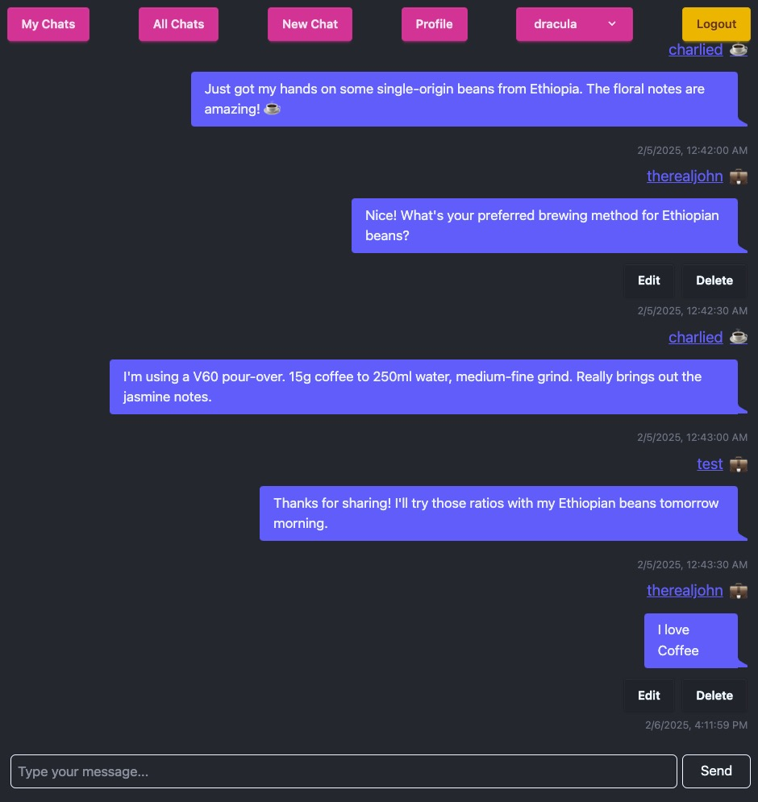

# Introduction
Parley is a streamlined chat application designed to provide users with a focused space for discussions on specific topics. The application aims to address the issues of fragmented conversations and lack of visual emotional cues in current digital communication platforms.

# Purpose & Motivation for Project
The purpose of Parley is to create a user-friendly platform for organized discussions, emotional expression, and community building. The motivation behind this project is to provide a solution to the problems faced by users in current chat applications, such as difficulty in engaging meaningfully and lack of structured channels.

# How to install and run the application
To install and run Parley, follow these steps:
* Clone the repository from GitHub.
* Install the required dependencies using `npm install`.
* Run the application using `npm run dev`.
* Open a web browser and navigate to [http://localhost:5173](http://localhost:5173) to access the application.

# How does the application work?
Parley allows users to create and join dedicated channels for specific topics. The application features user profiles, channel creation, message management, and community engagement. Here's an overview of how it works:
* Users can create channels with unique names and descriptions, facilitating organized discussions around specific interests.
* Each user has a profile displaying their username, tagline, and mood emoji, providing a quick visual representation of their emotional state.
* Users can send and receive messages within channels, complete with timestamps for context.
* The application supports multiple users in each channel, fostering collaboration and interaction among like-minded individuals.

# How was the application developed?
The development of Parley involved several stages, including:
* Wireframing: The wireframes for Parley can be found at [this link](https://miro.com/app/board/uXjVLDNTU1I=/?share_link_id=122216993054).
* Entity-Relationship Diagram ERD: [View ERD](https://dbdiagram.io/d/Parley-678956836b7fa355c3218cd9).

### Technologies Used
 
 
 
 
 
 
 

